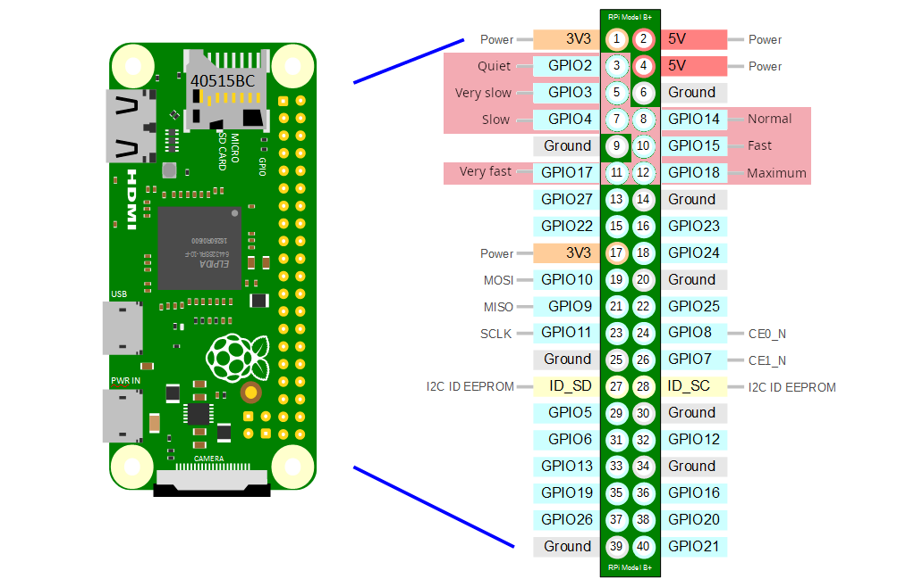

# EasyHome Hygro Premium SP controller

It allows to choose the humidity extractor speed via web page.

## Requirements
* Raspberry PI
* Up to 7 relays
* Software: pip, node, yarn

## Setup
We need to interface our Raspberry PI to the EasyHome Hygro card through relays.
There are currently two types of configurations available:
* **With normal relays**. When the Raspberry PI has not started is in `QUIET` speed.
* **With solid state relays**.

NOTE: If you want to shut down the EasyHome Hygro when the Raspberry PI has not started with
normal relays use the solid state configuration.
### Interfacing EasyHome Hygro card with Raspberry PI

#### Array of 7 relays

#### Array of 7 solid state relays

## Installation
```shell
git clone https://github.com/jamofer/humidity-extractor.git
cd humidity-extractor
./install.sh # ./install PRODUCT [default | solid state]
```
## Web server
It will open a web frontend in Raspberry PI at port 21000. It exposes an API rest too in the same port.

### API REST
#### GET /api/status
```json
{
"speeds": ["quiet", "normal", "maximum"],
"available_speeds": ["quiet", "maximum"],
"current": {
    "speed": "maximum",
    "ratio": 1.00,
    "real_ratio": 1.00
  }
}
```

#### GET /api/configuration
```json
{
  "velicity_ratio": 1.00,
  "product": "default"
}
```

#### POST /api/configure
```json
{
  "velocity_ratio": 0.54,
  "velocity_percentage": 66,
  "velocity": "quiet",
  "product": "default"
}
```

## Power consumption and acoustic measurements
### Power consumption [1]

### Acoustic [1]


## References
[1] Page 36: https://www.aldes-international.com/img/2019/10/Gamme_EasyHOME_Tech_Corp_En_2_HD.pdf
